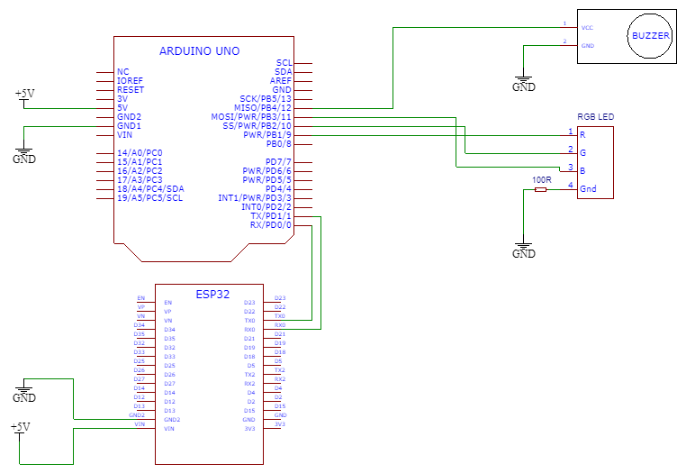
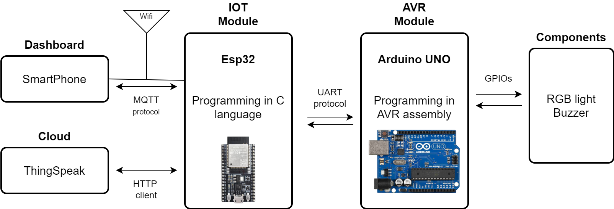

# Smart Color Mixer

Welcome to the Smart Color Mixer project repository! This project utilizes Arduino UNO, ESP32, and RGB LED technology to create an interactive lighting experience with various color modes.

## Table of Contents
- [Smart Color Mixer](#smart-color-mixer)
  - [Table of Contents](#table-of-contents)
  - [Overview](#overview)
  - [Features](#features)
  - [Components](#components)
  - [Getting Started](#getting-started)
  - [Methodology](#methodology)
    - [Circuit Diagram](#circuit-diagram)
    - [Data Flow Chart](#data-flow-chart)
  - [Documentation](#documentation)
  - [Project Video Links](#project-video-links)
  - [GitHub Repository](#github-repository)
  - [Contributors](#contributors)

## Overview

The Smart Color Mixer project allows users to control an RGB LED using a smartphone with the MQTT Dash app. It features various color modes, a startup sequence, and IoT integration for remote control and cloud logging.

## Features

- Five color modes: yellow, magenta, white, sequential animation, and all LEDs off.
- Distinctive startup sequence with a three-second beep.
- IoT integration using ESP32 for remote control and monitoring.
- Cloud logging of RGB LED color data on ThingSpeak.
- Modular design for future enhancements.

## Components

- Arduino UNO
- ESP32 Development Board
- Buzzer Module
- RGB LED Module
- Breadboard
- Various Jumper Wires
- 100-ohm Resistor

## Getting Started

To get started with the Smart Color Mixer project, follow these steps:
1. Clone the repository
2. Set up the hardware components according to circuit diagram
3. Upload the AVR and IoT module code on Arduino and ESP32 respectively
4. Explore the various color modes

For detailed instructions, refer to the [documentation](#documentation).

## Methodology

The methodology section explains the selection and configuration of hardware components, assembly and circuit design, programming of the AVR and IoT modules, and the integration and testing of the entire system. Read more in the [Methodology](#methodology) section.

### Circuit Diagram

### Data Flow Chart

## Documentation

Detailed documentation about the project, including explanations of the circuit design, programming logic, and system functionalities, can be found in the [Documentation](https://www.overleaf.com/read/cmzmmtzwzjmv#2f7dbc) section.

## Project Video Links

- [YouTube Video Link Placeholder](https://youtu.be/pDtTDaCUd7E)
- [LinkedIn Video Link Placeholder](https://www.linkedin.com/posts/muhammadwaliahmad_arduino-esp32-rgbled-activity-7148242745965400064-PseI)
## GitHub Repository

Explore the project's source code, circuit diagrams, and documentation on our [GitHub repository](https://github.com/mwaliahmad/Coal-Final-Project).

## Contributors

This project was brought to you by:
- [Muhammad Wali Ahmad](https://github.com/mwaliahmad)
- [Bisma Fajar](https://github.com/bismafajar816)
- [Leena Zaheer](https://github.com/leenazaheer734)
- [Amna Nadeem](https://github.com/amnanadeem166)

Feel free to contribute, report issues, or share your thoughts! 🚀
